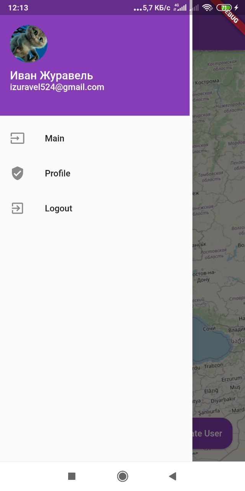

# Boilerplate Project

A Test User Map created in flutter using BLoC and Firebase. Test User Map supports only mobile

# Getting started

This project gives the user the ability to log in with Google, track the current location on the map in real time, see the last location of other registered users. Using the side menu, you can go to the profile page, or exit the application to the start screen.
On the profile page, you can see your avatar, name and current mail.

**Implemented tasks:**

 - Splash screen
 - Auth screen - a screen with a logo and authorization in the application using Google
 - Main screen:
     - Flutter Map
     - Button for displaying the user on the map
     - Button for uploading user data to the database
     - Side menu.
 - Profile screen

The map displays registered user markers in black and white, and a user marker in blue and yellow. By clicking on the user marker, a window with detailed information about the user is displayed.

In the side menu, the transition to the profile screen is implemented, and exit from the app to the authorization start screen.

The profile displays the user's avatar, name, and email.

**Stack:**

 - BLoC
 - Freezed
 - Firebase
 - Authorization with google email
 - Geolocation

# Screenshots

**Splash screen**

**Authorization screen**

**Main screen**

**Side menu**

**Profile screen**

